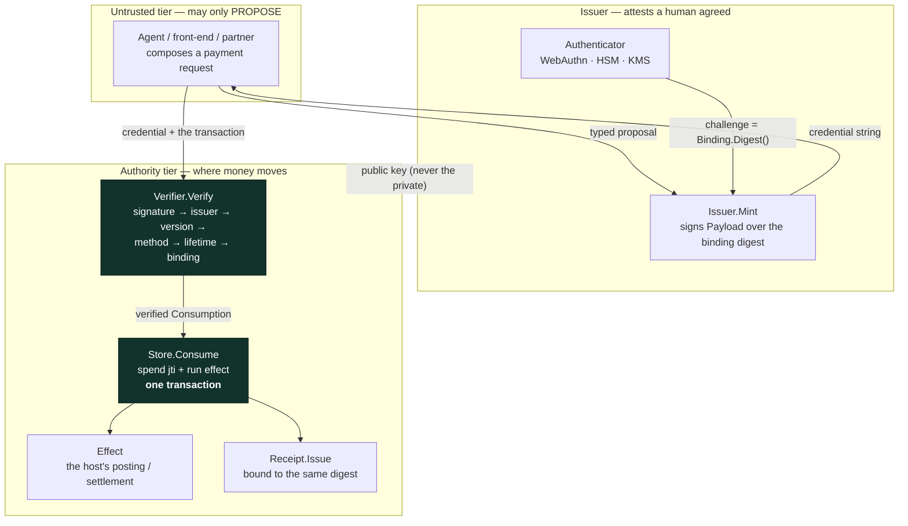
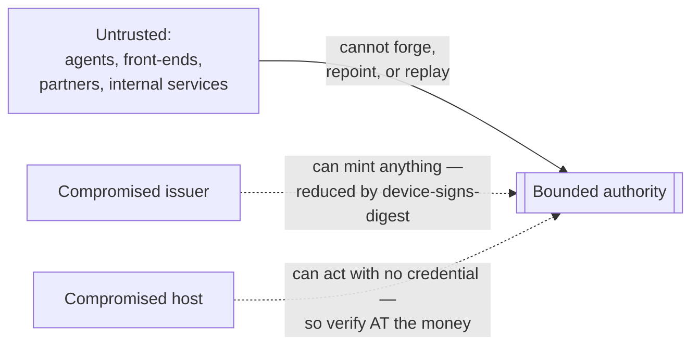
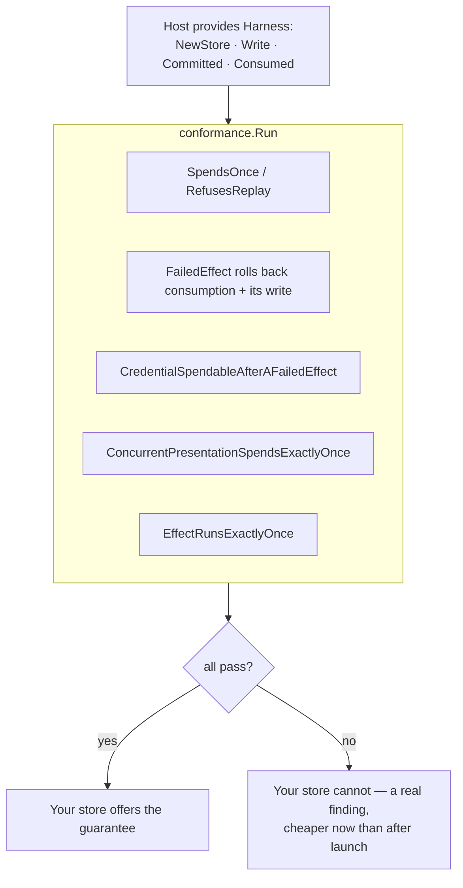
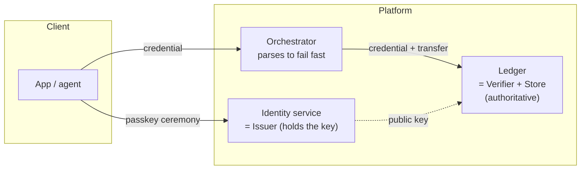

# BoundedAuth — architecture

The system design of a bounded-authority credential: what the pieces are, how a
payment is authorised, where the trust boundary sits, and how the conformance
suite proves an adopter's implementation. This document is the *design*; the
normative wire format and rules are in [SPEC.md](SPEC.md).

---

## 1. The organising idea

Authorisation is usually a **bearer token**: present a string, it is checked for
validity, the action proceeds. The token attests *who is calling*. It does not
attest *what they agreed to*.

BoundedAuth replaces that with a **bounded authority**: a signature over the exact
transaction, spent once, atomically with the money it moves. The design follows
from one commitment:

> Authority to move money is a **verifiable credential bound to one transaction**,
> not a permission.

Everything else — the per-issuer key map, the host-implemented `Store`, the
conformance suite, the receipt — is a consequence of making that property true
and checkable rather than asserted.

## 2. Components



| Component | Responsibility | Key property |
| --- | --- | --- |
| **Binding** | The exact transaction: payer, payee, amount, fee, currency, reference, context | Length-prefixed SHA-256 digest — no field-boundary collision, version bound in |
| **Issuer** | The only holder of a private key; mints credentials after authenticating a human | A named issuer; a credential says which issuer it came from |
| **Verifier** | Checks a credential against the exact transaction | Per-issuer key map; fails closed; signature checked *before* any payload field is trusted |
| **Store** *(host-implemented)* | Spends the credential once, atomically with the effect | The contract the conformance suite tests |
| **Receipt** | Evidence of what happened, bound to the same digest | `Intact` (unaltered) and `MatchesAuthority` (describes the right payment) are distinct checks |

## 3. The critical path — authorising one payment

```mermaid
sequenceDiagram
    autonumber
    participant A as Agent / caller
    participant I as Issuer
    participant V as Verifier
    participant S as Store (host DB)
    participant E as Effect (ledger)

    A->>I: propose transaction (payer, payee, amount, …)
    Note over I: authenticate the human;<br/>challenge = Binding.Digest()
    I-->>A: signed credential (≤5 min, single-use)

    A->>V: Authorise(credential, Binding, effect)
    rect rgb(18,51,43)
        Note over V,E: ONE host transaction
        V->>V: verify signature FIRST, then issuer/version/method/lifetime/binding
        V->>S: Consume(consumption, effect)
        S->>S: record jti (primary key) — fails if already spent
        S->>E: run effect on THIS transaction (post the money)
        S->>S: commit — or roll back, leaving the credential spendable
    end
    V-->>A: Consumption (or a typed refusal)
```

The ordering is the security argument:

1. **Signature before payload.** Nothing inside the credential influences a
   decision until its signature verifies under the *named issuer's* key. The
   payload is read once, untrusted, only to select that key.
2. **Binding before consumption.** A credential presented for the wrong
   transaction is refused *without being spent*, so an observer cannot burn
   someone else's authority by presenting it against a transaction they control.
3. **Consume with the effect, or neither.** Recording the spend and performing
   the effect are one commit. This is the property hosts implement wrong, and the
   reason the `Store` is theirs and the suite is ours.

## 4. Trust boundary



| Adversary | Outcome |
| --- | --- |
| Untrusted proposer (agent, front end, partner) | **Contained.** The worst achievable is the payment a human actually signed. |
| Network / man-in-the-middle | Cannot alter the transaction (signature covers it) or replay it (single-use). Transport must still be confidential. |
| Compromised **issuer** | Can mint authority — but if the authenticator challenge is the binding digest, cannot obtain a *device* signature for a payment the human never saw. |
| Compromised **host** | Can perform effects with no credential — which is why verification belongs at the point money moves, not at an API edge. |

## 5. The conformance model — testing the adopter, not the library

The single-use-atomic property lives in the host's transaction, so the library
cannot guarantee it. Instead it **inverts the test**: the host provides a small
harness, and the suite exercises the failure modes that a quiet test never hits.



And the suite is itself held to account: a self-test runs it against **three
deliberately broken stores** — check-then-act (lock released across the effect),
mark-before-effect (consumption committed too early), and double-effect (the
effect run twice) — and asserts each named check catches the failure it exists
for. A conformance suite never shown to fail anything is a claim, not a check.

## 6. Where it sits in a payments system (adoption topology)



The recommended placement, and the one EPHERA uses:

- **Issuer = the identity service** — the only holder of a private key; runs the
  WebAuthn ceremony with the binding digest as the challenge.
- **Verifier + Store = the ledger** — the authority for balances verifies and
  consumes at the point money moves, so no internal service can post without a
  credential. An orchestrator may parse a credential to fail fast, but its opinion
  authorises nothing.
- **Effect = the ledger's own posting**, committed in the same transaction as the
  consumption and the receipt.

See [ADOPTION.md](ADOPTION.md) for the step-by-step integration, the five
decisions to make first, migration from bearer tokens, and the ways to get it
wrong.

## 7. Non-goals (v1)

- **Authentication** — binding a human to a key is the issuer's job.
- **Key rotation** — verifiers hold both keys during an overlap longer than the
  maximum lifetime; a managed rotation flow is future work.
- **A licensed screening / policy layer** — orthogonal; this is the authorisation
  primitive, not the compliance decision.
