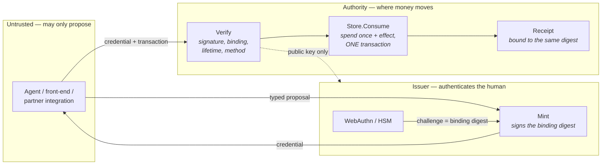

# BoundedAuth

**Bounded authority for money movement** — a signed, transaction-bound,
single-use credential that lets an untrusted or non-deterministic component
*propose* a payment without letting it *authorise* one. The worst a compromised
or prompt-injected agent can achieve is the payment a human actually signed.

<p>
  <a href="https://github.com/FrankAsanteVanLaarhoven/BoundedAuth-AI/actions/workflows/ci.yml"></a>
  
  
  
  
</p>

```go
_, err := boundedauth.Authorise(ctx, verifier, store, credential, boundedauth.Binding{
    Payer: "wallet:alice", Payee: "wallet:bob",
    AmountMinor: 50_000, FeeMinor: 250, Currency: "GHS",
    Reference: transferID,
}, func(ctx context.Context, granted boundedauth.Consumption) error {
    // Runs inside the host's transaction. The credential is spent and this
    // effect commit together, or neither happens.
    return ledger.Post(ctx, transferID, granted.ID)
})
```

**Contents** · [Problem](#the-problem) · [What it gives you](#what-it-gives-you) · [Architecture](#architecture) · [Install](#install) · [The conformance suite](#why-the-conformance-suite-is-the-point) · [What is checkable](#what-is-checkable) · [Security model](#security-model) · [Not claimed](#not-claimed) · [Design docs](#design-and-specification)

---

## The problem

A token says *who* the caller is. It does not say *what they agreed to*. Anything
holding a valid token can move any amount to any recipient within its scope, as
often as it likes.

That was tolerable when the caller was a person clicking a button. It stops being
tolerable when the caller is an automated agent composing payment requests from
text it was handed — because the question stops being *is this caller
authenticated* and becomes *did a human agree to **this** payment*.

Agentic-commerce efforts all circle the same unsolved problem: how do you let a
non-deterministic actor propose a payment without letting it authorise one? The
common answer — a scoped bearer token — is still forgeable by whoever holds the
issuing key and still not bound to a specific transaction. BoundedAuth binds the
signature to the transaction itself.

## What it gives you

The signature covers the exact transaction — payer, payee, amount, fee, currency,
reference, and optional context. So:

| Property | Meaning |
| --- | --- |
| **Not repointable** | A credential obtained for one payment cannot be presented for another — by anyone, including the service that requested it. |
| **Single-use, atomically** | The authority is spent exactly once, in the same transaction as the money it moves. Consume and effect commit together or neither happens. |
| **Device-bound (recommended)** | Where the authenticator challenge *is* the binding digest, the device signs the transaction, so even a compromised issuer cannot obtain a signature for a payment the human never saw. |
| **Evidence is the same chain** | A receipt is bound to the same digest and cross-checked against its own fields, so a receipt that describes a different payment than was authorised is detectable, not silent. |

The consequence, stated plainly: **an agent can be wrong, prompt-injected, or
hostile, and the worst it achieves is the payment that was actually signed.**

## Architecture



Two module boundaries, drawn where they matter:

- **The verifier is a value, not a global.** It holds a per-issuer public-key map,
  so trusting a second issuer never widens what the first can authorise. It fails
  closed: no key, no authorisation.
- **Single use is the host's `Store`, not the library's.** "Spend once, atomically
  with the effect" is a property of *your* transaction boundary — the library
  cannot provide it, so it supplies a **conformance suite that tests yours**.

Full component and sequence diagrams: **[ARCHITECTURE.md](ARCHITECTURE.md)**.
Normative wire format and rules: **[SPEC.md](SPEC.md)**.

## Install

```bash
go get github.com/FrankAsanteVanLaarhoven/BoundedAuth-AI
```

```go
import boundedauth "github.com/FrankAsanteVanLaarhoven/BoundedAuth-AI"
```

The PostgreSQL reference store is a **separate module**, so embedding the verifier
does not pull in a database driver:

```bash
go get github.com/FrankAsanteVanLaarhoven/BoundedAuth-AI/postgres
```

The core has **zero dependencies** outside the Go standard library.

## Why the conformance suite is the point

The cryptography here is a few hundred lines and either works or fails obviously.
The requirement that gets shipped broken is **atomicity** — that spending the
credential and doing the work commit together.

A broken implementation passes normal testing and passes review, because the code
reads correctly: look up, check, mark, act. It fails under concurrency and under
partial failure — which is to say it fails in production, on the money path.

So [`conformance`](conformance/) tests **your** store, not this library:

```go
func TestConformance(t *testing.T) {
    conformance.Run(t, conformance.Harness{
        NewStore:  func(t conformance.TB) boundedauth.Store { return myPostgresStore(t) },
        Write:     func(ctx context.Context, key string) error { /* inside the tx */ },
        Committed: func(t conformance.TB, key string) bool { /* observed outside */ },
        Consumed:  func(t conformance.TB, id string) bool { /* observed outside */ },
    })
}
```

It runs the failure modes that never occur in a quiet test environment:
simultaneous presentation of one credential, an effect that fails after the
credential has notionally been spent, and an effect that runs twice. If your
`Write` cannot run inside the transaction `Consume` opened, the suite fails —
correctly, because your store cannot offer the guarantee whatever its code says.

**The suite is itself tested against three deliberately broken stores** — check-then-act,
mark-before-effect, and double-effect — one for each classic anti-pattern, so
every check has been *demonstrated* to fail something. A conformance suite that
has never been shown to fail anything is a claim, not a check.

## What is checkable

Everything below is a command, not a promise. `go test ./... -race` runs them all.

| Claim | How to check it |
| --- | --- |
| The spec is complete enough to implement from | `python3 testdata/verify_vectors.py` — a second implementation, written from `SPEC.md` in another language, reproducing all **10** vectors |
| Binding covers every field that decides where money goes | `go test -run TestEveryBindingFieldChangesTheDigest` |
| A credential cannot be repointed to another payment | `go test -run TestRepointingIsRefused` |
| Repointing does not burn the credential | `go test -run TestARepointedCredentialIsNotSpent` |
| The lifetime ceiling holds even against its own issuer | `go test -run TestLifetimeCeilingIsEnforcedAtVerifyNotOnlyAtMint` |
| `method` is a closed set; a near-miss cannot slip the test gate | `go test -run TestUnknownMethodIsRefused` |
| A receipt showing the wrong payment fails `MatchesAuthority` | `go test -run TestReceiptWithMismatchedFieldsFailsMatchesAuthority` |
| The in-memory store satisfies the atomicity contract | `go test ./memory/... -race` |
| A **PostgreSQL** store satisfies it on a real database | `cd postgres && BOUNDEDAUTH_TEST_DATABASE_URL=... go test ./... -race` |
| The conformance suite fails stores that do not | `go test ./conformance/... -race` |

**Real-data workload study.** The [`bench/`](bench/) harness replays the IEEE-CIS
Fraud Detection dataset (590,540 real transactions) through the full path against
PostgreSQL: ~21,000 authorised payments/s at ~3 ms median on a single host,
refusal ~3× cheaper than acceptance, every replay and repointing attempt refused
at volume. The methodology and its threats-to-validity are in the executed
[notebook](notebooks/ieee-cis-workload-study.ipynb).

## Security model

**What it defends against.** A compromised or malicious component that can compose
payment requests — an agent, a front end, a partner, an internal service — cannot
obtain authority for a payment the human did not sign, cannot alter the amount or
recipient, and cannot replay the authority for a second payment.

**What it does not.** A compromised **issuer** can mint authority for anything,
because the issuer is what attests a human agreed — using the binding digest as
the authenticator challenge reduces this but does not eliminate it. A compromised
**host** can perform effects with no credential, which is why verification belongs
at the point money moves, not at an API edge. Key rotation is out of scope in v1
(verifiers hold both keys during an overlap longer than the maximum lifetime).

This library was **red-teamed before publication**: the credential half held
(forge, repoint, and replay all refused; the PostgreSQL single-use and atomicity
verified under the race detector), and the findings in the evidence half and a
few claimed-property gaps were fixed with a regression test each.

## Not claimed

Stated plainly, because a security library that omits its limits is worth less
than one that admits them.

- **No third-party audit or penetration test.** It has been internally
  red-teamed; the tests are written by the author of the code.
- **No key rotation** in version 1.
- **This does not authenticate anyone.** It verifies a credential minted by an
  issuer you trust; binding a human to a key is the issuer's job.
- **A compromised issuer can mint authority for anything** (reduced, not
  eliminated, by §3.3 of the spec).
- **`memory` is a reference implementation, not a durable store.**
- **No production deployment.** It was extracted from a payments platform that has
  never handled live funds.

## Design and specification

| Document | What it is |
| --- | --- |
| **[MANUSCRIPT.md](MANUSCRIPT.md)** | The engineering-research record: hypothesis → failures → refinement → evidence, plus governance, KPIs, risk, reproducibility, and an honest validation/certification status |
| **[ARCHITECTURE.md](ARCHITECTURE.md)** | Components, the authorise sequence, the trust boundary, the conformance model, adoption topology |
| **[SPEC.md](SPEC.md)** | Normative wire format, digest construction, verification steps, receipt rules — precise enough to reimplement from |
| **[ADOPTION.md](ADOPTION.md)** | How to put it into a system that already moves money: the five decisions, integration steps, migration, operations, and the ways to get it wrong |

## Layout

| Path | Contents |
| --- | --- |
| `authority.go` | Binding digest, `Issuer.Mint`, `Verifier.Verify` |
| `store.go` | The `Store` contract and `Authorise` |
| `receipt.go` | Receipts bound to the authority that permitted them |
| `conformance/` | Checks a host's store; itself tested against broken stores |
| `memory/` | Reference store — passes the suite under `-race` |
| `postgres/` | PostgreSQL reference store — separate module, keeps the core dependency-free |
| `bench/` | Real-data workload benchmark (IEEE-CIS) |
| `testdata/` | Cross-language vectors and the second implementation |

## Who implements the contract

| Implementation | Status |
| --- | --- |
| `memory` | Reference. Passes the suite under `-race`. |
| `postgres` | Reference. Passes on a real PostgreSQL under `-race`. |
| EPHERA ledger | Passes the same suite, exercising the exact statement that posts money. |

The last row is the one worth reading twice. The contract was extracted from that
ledger, which makes it the implementation most likely to be assumed correct and
least likely to be tested against the thing it inspired — so it is now judged by
the same suite an outside adopter would run.

## Contributing

Pull requests are welcome under the rules in [CONTRIBUTING.md](CONTRIBUTING.md) —
the core stays dependency-free, every claimed property ships with a failing-first
test, and the conformance suite is the contract. Report vulnerabilities privately
via [SECURITY.md](SECURITY.md), never a public issue.

## Licence

[Apache License 2.0](LICENSE) — permissive, with an explicit patent grant. See
[NOTICE](NOTICE) for attribution, [TRADEMARKS.md](TRADEMARKS.md) for name use, and
[THIRD_PARTY_NOTICES.md](THIRD_PARTY_NOTICES.md) for dependency licences.
